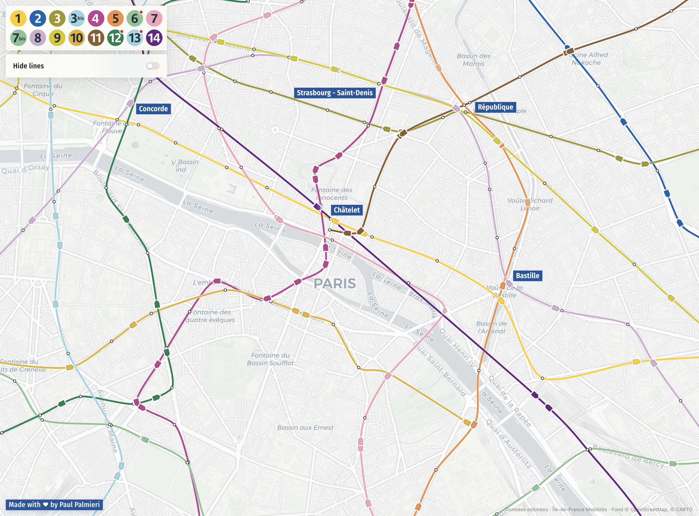

# Paris Métro

An estimated live map of the Paris Métro.



Île-de-France Mobilités does not publish the GPS position of each train. The
live feed gives us the next stops and their expected times. Metro turns those
predictions into a continuous animation using calibrated travel and dwell
times.

The result is an estimate, not a measured train position.

## Run it

You need Node.js 20+, the [Vercel CLI](https://vercel.com/docs/cli), and a PRIM
API key.

```bash
npm install
cp .env.example .env
npm run dev:api
```

Add your key to `.env`:

```dotenv
PRIM_API_KEY=
PRIM_API_KEY_SECONDARY=
```

The second key is optional. It is only used when the first one reaches its rate
limit.

Run the checks with:

```bash
npm test
npm run build
```

## Calibration

Raw SIRI captures stay in `data/` and are ignored by Git.

```bash
npm run snapshot:calibrate
npm run analyze:calibration
```

The interpolation model and calibration process are documented in
[the train movement note](docs/train-movement.md).

## Data

Timetables and service status come from
[Île-de-France Mobilités PRIM](https://prim.iledefrance-mobilites.fr/).
The base map uses CARTO tiles with OpenStreetMap data. The line pictograms are
public-domain files from Wikimedia Commons.

This project is not affiliated with Île-de-France Mobilités or RATP.

## License

[MIT](LICENSE)
